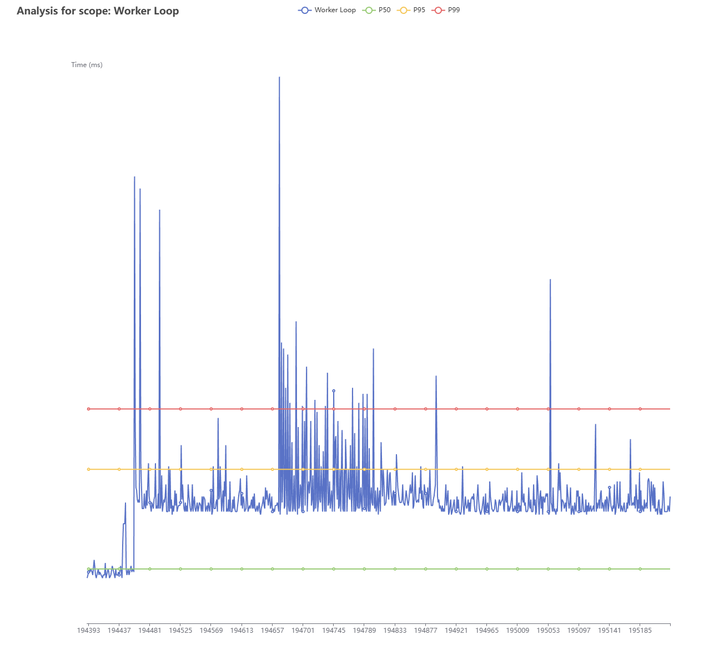

# RSP CLI

This is a standalone binary (written in Go) that performs some common types of analysis given profiler output. There is a bunch
more that still needs to come across from our internal repo, but this is a pretty good start and hits the major things.

## Building

To build it: `./build_cli.sh` (for Linux, macOS) or
`.\build_cli_nt.bat` (for Windows) from the top-level directory. You
need to have a `golang` toolchain available and on `$PATH`.  The `go`
build will bring in any dependencies that are needed.

The nice thing about the `go` binary is that it's portable: you can
build it once and copy it to different machines as needed without
needing to worry about dependencies (provided it's the same OS and
arch, of course).


The `rsp` binary will be in the `bin/` directory at the top of the project. Copy it somewhere convenient and make sure it's on your `$PATH`.

## Usage

Running the binary with no options will give you a helpful message:

```
$ ./bin/rsp
NAME:
   rsp - Common performance analysis tooling for the RSP profiler.

USAGE:
   rsp [global options] command [command options]

COMMANDS:
   echo         Dump out the profiling data to stdout. Not very useful, but sometimes handy for debugging or quick inspection.
   timings      Plot elapsed times in milliseconds and visualize p50, p90 and p99.
   scopes       Show which scopes are logged, and how many data entries for each
   percentiles  Print p50, p95 and p99 for a given scope
   help, h      Shows a list of commands or help for one command

GLOBAL OPTIONS:
   --help, -h  show help
```

Each of the subcommands performs a particular type of analysis/visualization for you.

You can view the options needed/provided by each of the subcommands by running `rsp <subcommand> --help`.

### `echo` subcommand

This is a fairly useless option for real usage as all it does is dump out the deserialized scope information
to stdout. It's useful for quickly eyeballing that the log is readable, but that's about it.

```
NAME:
   rsp echo - Dump out the profiling data to stdout. Not very useful, but sometimes handy for debugging or quick inspection.

USAGE:
   rsp echo [command options] <filename>

OPTIONS:
   --help, -h  show help
```

### `scopes` subcommand

```
NAME:
   rsp scopes - Show which scopes are logged, and how many data entries for each

USAGE:
   rsp scopes [command options] <filename>

OPTIONS:
   --help, -h  show help
```

Prints out which scopes are present in the log, and the number of data points associated with each scope. Example:

```
$ ./bin/rsp scopes /tmp/big_example.bin
+-------------+--------+
| SCOPE       |  COUNT |
+-------------+--------+
| Worker Loop | 480000 |
+-------------+--------+
```

### `percentiles` subcommand
```
NAME:
   rsp percentiles - Print p50, p95 and p99 for a given scope (in milliseconds)

USAGE:
   rsp percentiles [command options] <filename> <scope>

OPTIONS:
   --help, -h  show help
```

Example output:

```
$ ./bin/rsp percentiles /tmp/big_example.bin "Worker Loop"
2025/12/04 11:24:31 Analyzing scope Worker Loop, from /tmp/big_example.bin
2025/12/04 11:24:32 Found 480000 entries for scope Worker Loop
+------------------------+----------------------+-----------------------+
|                    P50 |                  P95 |                   P99 |
+------------------------+----------------------+-----------------------+
| 0.00018004304829284684 | 0.000510121970163066 | 0.0007101698015995624 |
+------------------------+----------------------+-----------------------+
```

### `timings` subcommand

```
NAME:
   rsp timings - Plot elapsed times in milliseconds and visualize p50, p90 and p99.

USAGE:
   rsp timings [command options] <filename> <scope>

OPTIONS:
   --output value, -o value  Save results to the specified file
   --bind value, -b value    Address and port to bind to. (default: "localhost:8080")
   --help, -h                show help
```

This will visualize (graph) the timing information for the given scope, and allow you to easily
eyeball the `p50`, `p95` and `p90`.

The output can be generated in one of two ways.

Saved to disk, such as:

```
$ ./bin/rsp timings -o ~/big_example.html /tmp/big_example.bin "Worker Loop"
2025/12/04 11:26:44 Analyzing scope Worker Loop, from /tmp/big_example.bin
2025/12/04 11:26:44 Found 480000 entries for scope Worker Loop
2025/12/04 11:26:48 Saved charts page to /home/ajf/big_example.html
```

Or, by default, served via HTTP on `localhost:8080`.

```
$ ./bin/rsp timings /tmp/big_example.bin "Worker Loop"
2025/12/04 11:27:42 Analyzing scope Worker Loop, from /tmp/big_example.bin
2025/12/04 11:27:43 Found 480000 entries for scope Worker Loop
2025/12/04 11:27:43 Serving charts page at http://localhost:8080/
```

You can change the port and interface binding as you need by adding:

```
$ ./bin/rsp timings -b 127.0.0.1:9091 /tmp/big_example.bin "Worker Loop"
2025/12/04 11:28:22 Analyzing scope Worker Loop, from /tmp/big_example.bin
2025/12/04 11:28:23 Found 480000 entries for scope Worker Loop
2025/12/04 11:28:24 Serving charts page at http://127.0.0.1:9091/

```

The plotting is provided by the wonderful `go-echarts` library (https://github.com/go-echarts/go-echarts). It's zoomable, pannable
and you can toggle off the various visualizations (such as the percentiles) if needed. Each datapoint can also be selected to get
an exact numerical value if you need.

Here is an example screenshot:




